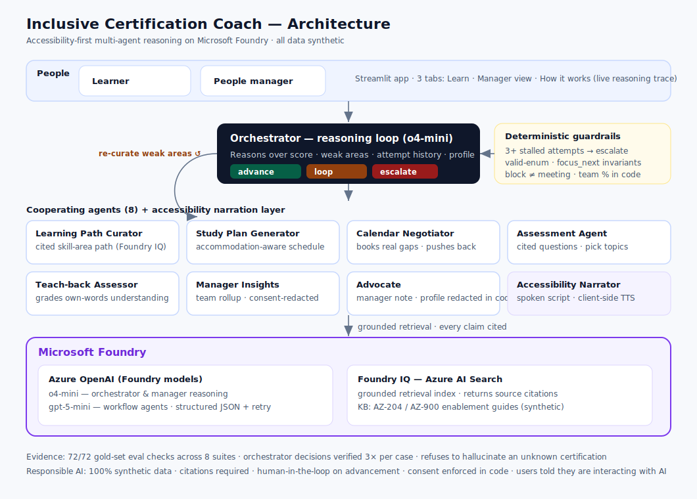

# Inclusive Certification Coach

A multi-agent enterprise learning system for the **Microsoft Agents League — Reasoning Agents** track. It helps organisations run internal certification programmes, designed **accessibility-first** so that employees with disabilities (neurodivergent, cognitive, low-vision) get certification prep that adapts to how they actually work.

> **Status:** 8 agents built, grounded via Foundry IQ, with a **real bounded reasoning loop** (focused remediation on weak areas, escalation after stalled attempts), **calendar-negotiated study plans** that push back with evidence when the week has no time, **Socratic teach-back assessment** that grades understanding rather than option-picking, **per-skill memory decay** with spaced refreshers, **consent-boundary advocacy** (the learner controls what the manager sees; redaction enforced in code), deterministic guardrails around every LLM decision, a visible reasoning trace down to the retrieved chunks, screen-reader-first spoken output with browser read-aloud, a Streamlit demo, and gold-set evals (**72/72 checks across 8 suites, decisions verified 3× per case**). **Data:** 100% synthetic — no real people, no PII (identifiers like `L-1001`, `EMP-001`, `TEAM-A`).

---

## Why this project

The challenge scenario is an enterprise certification-learning system. Most implementations treat every learner identically. Ours adds two things that matter:

1. **Inclusive by design** — study paths, pacing, and assessments adapt to cognitive load, focus windows, and accessible formats, instead of one-size-fits-all.
2. **A visible reasoning trace** — the UI shows *which agent did what, what it retrieved, what it cited, and why the orchestrator looped or advanced*. The track is about reasoning, so we make the reasoning legible.

---

## Links

- **Demo video (≤ 5 min):** https://youtu.be/aNrbi3qeOe0
- **Submission (Agents League — Reasoning Agents):** https://innovationstudio.microsoft.com/hackathons/Agents-League-Hackathon/project/123869
- **Architecture diagram:** [`docs/architecture.svg`](docs/architecture.svg) — shown below

---

## Architecture



Eight cooperating agents — six in the per-learner reasoning loop (Curator,
Study Plan, Calendar Negotiator, Assessment, Teach-back, Orchestrator), a
team-level Manager Insights agent, and an Advocate — plus an Accessibility
Narrator rendering layer.

| Agent | Type | Job | Grounding |
|---|---|---|---|
| Learning Path Curator | workflow step | Map a certification goal to skills + cited modules, with per-module accommodation notes | Foundry IQ |
| Study Plan Generator | workflow step | Turn the cited path into an accommodation-aware day-by-day schedule (block sizes, breaks, checkpoints) | Foundry IQ (pacing rules) |
| Calendar Negotiator | hybrid reasoning | Book study blocks into the learner's REAL calendar gaps — or push back with evidence (needed vs available minutes, projected timeline, manager-ready message, trade-off options) when the week can't hold the plan | synthetic Graph-shaped calendar |
| Assessment Agent | workflow step | Generate grounded, cited practice questions; score readiness; report weak areas | Foundry IQ |
| Teach-back Assessor | Socratic reasoning | Grade the learner's own-words explanation: concepts covered/missing, misconceptions, one targeted follow-up probe; feeds the orchestrator like any score | Foundry IQ |
| Orchestrator | reasoning loop | Reason over score, weak areas, history, and accessibility profile to decide: advance, loop back to weak areas, or escalate to a human | — |
| Manager Insights | reasoning / analytics | Roll up a team's progress: per-learner status, team readiness %, recommended actions — over consent-redacted records only | synthetic team records (redacted in code) |
| Advocate | consent-boundary reasoning | Draft evidence-based notes to the manager ON THE LEARNER'S BEHALF; enforce in code that non-consenting learners' accessibility context never reaches a manager-facing model | learner evidence + consent flags |

**Memory decay model** (`src/mastery.py`, pure code): every skill's mastery
decays with a half-life that doubles per review (the spacing effect). Skills
that were learned but are fading get flagged for a short refresher *before*
they're forgotten; skills never mastered go through the remediation loop
instead. The coach reasons longitudinally, not per-session.

**Microsoft IQ layer:** Foundry IQ (Azure AI Search), grounded retrieval with citations.

**Reasoning patterns used:** grounded retrieval (every answer cited to Foundry IQ sources), an orchestrated decision loop (the Orchestrator reasons over score, weak areas, attempt history, and accessibility profile to choose advance / loop-to-weak-areas / escalate), human-in-the-loop escalation on stalled attempts, and team-level reasoning (Manager Insights rolls per-learner state up to a readiness verdict). The reasoning model (o4-mini) emits its deliberation — `signals_considered` and `alternatives_rejected` — and the UI shows it rather than hiding it.

**The loop is real, not a label.** A `loop` decision re-invokes the Curator on
*only* the weak skill areas, generates a lighter remediation schedule, and
issues a focused retake. Attempt history persists and grows, so the
orchestrator sees trends (improving vs stalled), and the loop is bounded:
three attempts with little improvement always reach a human coach.

```
Learner goal (cert + role + accessibility profile)
   -> Curator         : Foundry IQ retrieval -> cited, accommodation-aware learning path
      -> Study Plan   : Foundry IQ pacing rules -> accommodation-aware schedule
         -> Assessment: Foundry IQ retrieval -> cited questions -> score + weak areas
            -> Orchestrator (reasoning model): given score + weak areas + attempt
               history + accessibility profile, decide
                  advance      (ready)
                  loop         (not ready) --> Curator re-runs on ONLY the weak
                                               areas -> lighter remediation plan
                                               -> focused retake -> decide again
                  escalate     (3+ attempts, little improvement -> human coach)
   -> every step appended to a visible reasoning trace shown in the UI,
      including the retrieved chunks (source + relevance) and the
      orchestrator's signals_considered / alternatives_rejected

Manager Insights (team view): reasons over synthetic team records (TEAM-A)
   -> per-learner status (ready / on_track / at_risk / needs_support)
      + team readiness % + recommended manager actions
```

Run the loop end-to-end in the terminal (simulated improving learner —
watch it loop twice, narrow the path from 5 modules to 1, then advance):

```bash
python -m src.orchestrator
```

### Reliability engineering

LLMs misfire; a coach must not. Three layers keep the demo and the decisions safe:

1. **Structured output + parse retry** (`src/foundry_client.py`) — every JSON
   call uses the endpoint's JSON mode and re-prompts once on a parse failure,
   so a single malformed reply never crashes a session.
2. **Deterministic guardrails on the decision** (`src/orchestrator.py`) — the
   model reasons freely, but invariants are enforced in code: the action must
   be a valid enum; a stalled learner (3+ attempts, <10-point improvement,
   not ready) always reaches a human; advancing clears `focus_next`; looping
   always names what to revisit. Corrections are recorded in
   `guardrail_notes` and shown in the trace — visible, not silent.
3. **Hybrid symbolic + LLM reasoning** (`src/agents/manager_insights.py`,
   `src/agents/calendar_negotiator.py`, `src/mastery.py`) — arithmetic and
   interval math are computed in Python (readiness %, calendar gaps, slot
   allocation, memory decay); the LLM spends its reasoning where judgment
   lives: pacing policy, negotiation narrative, trends, support needs. A
   booked study block cannot overlap a meeting *by construction*.

### Why employees would actually use this

Three features aimed at the real reasons certifications stall — time,
shallow assessment, and forgetting:

- **Calendar-negotiated study plans** (`src/agents/calendar_negotiator.py`).
  A plan that ignores your meetings is a plan you won't follow. The negotiator
  finds genuine gaps in a (Graph-shaped, synthetic) work calendar, books
  accommodation-sized blocks into them, and — when the week simply doesn't
  have the time — refuses to pretend: it shows needed-vs-available minutes,
  projects the realistic timeline, drafts an evidence-based note to the
  manager, and lays out trade-off options. The agent advocates for the
  learner instead of guilt-tripping them.
- **Teach-back assessment** (`src/agents/teachback.py`). Multiple choice
  measures recognition; explaining measures understanding. The learner
  explains a skill in their own words (typed or dictated — no answer grid to
  visually scan), and the agent grades meaning against the KB: concepts
  covered, the *specific* missing piece, any misconception to un-learn, and
  one Socratic follow-up aimed at the biggest gap. The final grade flows into
  the orchestrator exactly like a quiz score.
- **Memory that decays honestly** (`src/mastery.py` + the "Your memory" panel).
  Passing Storage three weeks ago is not knowing Storage today. Mastery decays
  on a per-skill half-life that doubles with each review, and the coach offers
  a short refresher at the learned-then-fading moment — when review is cheap —
  rather than re-teaching after the knowledge is gone.
- **Consent-boundary advocacy** (`src/agents/advocate.py`). The learner
  controls what the manager sees. Accessibility profiles are private by
  default and redacted IN CODE before any manager-facing model call — the
  model cannot leak what it never saw. When the learner wants something
  (protected study time, more weeks, a lighter load), the Advocate drafts an
  evidence-based note on their behalf, with a disclosure ledger (what the
  note shares vs keeps private), a deterministic leak check as defence in
  depth, and an explicit Approve step before anything counts as sent.

### Accessibility & voice

Inclusion is the whole point, so output is not text-only-on-a-screen:

- **Accessibility Narrator** (`src/accessibility.py`) converts any agent's
  structured output into a **screen-reader-first spoken script** — linear plain
  text, no tables or markdown, abbreviations spelled out (`AZ-204` -> "A Z two oh
  four"), symbols read as words ("75 percent"), adapted to the learner's profile.
- **Read aloud in the UI** plays that script using the browser's Web Speech API
  (`SpeechSynthesis`) — client-side, free, no audio model.

This respects the hard model constraint (the reasoning models are text-only;
multimodal is out of scope here): the *speech* is produced in the browser, the
*text* is produced by the model, so nothing depends on an audio model. Voice
**input** (dictation) is a documented next step.

---

## Setup

```bash
git clone <this-repo>
cd inclusive-certification-coach

python3 -m venv .venv
source .venv/bin/activate          # Windows: .venv\Scripts\activate
pip install -r requirements.txt

cp .env.example .env               # then fill in your Foundry values
```

Run the demo UI:

```bash
streamlit run app/streamlit_app.py
```

---

## Data sources

All synthetic.

- `data/knowledge_base/` — certification guides used for grounded retrieval via Foundry IQ: `az204_enablement_guide.md` (`KB-AZ204-001`) and `az900_fundamentals_guide.md` (`KB-AZ900-001`). To use AZ-900 in the demo, index the new file into your Azure AI Search index; until then the Curator will (correctly) refuse it rather than invent a path — that refusal is itself covered by the groundedness eval.
- `data/synthetic/team_records.json` — fabricated team (`TEAM-A`) of learner records (`L-1001` / `EMP-001` …) consumed by the Manager Insights agent.
- `data/synthetic/calendar_light_week.json` / `calendar_packed_week.json` — Microsoft Graph-shaped synthetic work calendars (no real meetings) consumed by the Calendar Negotiator; the packed week exercises the pushback branch.
- `data/state/mastery_demo.json` — seeded per-skill memory state for the demo learner (past-dated reviews so decay is visible); updated automatically as assessments are scored.

Identifiers are fabricated for demonstration only. No real people, no PII.

---

## Responsible AI

- Synthetic data only; no PII.
- Citations required on all grounded answers.
- Human-in-the-loop on advancement decisions.
- Users are told they are interacting with AI.

---

## Evaluation

Gold-set evals validate what matters on the Reasoning track:

- **`decisions`** — orchestrator reasoning accuracy across 9 gold cases (advance / loop / escalate), including the accommodation-aware supportive-loop branch and three adversarial cases: a declining-but-still-ready learner, an improving third-attempt learner who must loop rather than escalate, and a 0% first attempt that must never escalate.
- **`groundedness`** — citation fidelity for Curator, Study Plan Generator, and Assessment: agents emit only KB-backed skill areas / study hours, schedules respect the stated daily load, every grounded item cited — plus a **negative test**: a certification absent from the KB must be refused with an explanation, not hallucinated.
- **`manager`** — Manager Insights team rollup: every learner covered, valid statuses, the ready set and team readiness % match the threshold ground truth, stalled learners flagged for human support.
- **`accessibility`** — the Accessibility Narrator's spoken output is screen-reader friendly: no markdown/tables, no raw `%`, abbreviations spelled out.

```bash
python -m evals.run_evals                       # all suites
python -m evals.run_evals --repeat 3            # decisions run 3x per case (reliability)
python -m evals.run_evals --suite decisions     # reasoning only, no Search resource needed
python -m evals.run_evals --suite manager       # reasoning only, no Search resource needed
```

Three further suites cover the newer agents:

- **`calendar`** — negotiation correctness: booked blocks never overlap meetings, stay inside work hours and the daily accommodation cap, and every required minute fits on a light week; a packed week must be declared infeasible with a manager-ready message and ≥2 trade-off options.
- **`teachback`** — grading quality: a complete explanation scores well (and outscores an incomplete one — a relative check robust to grader strictness), an incomplete one names the missing concepts, a wrong one gets its misconception flagged and a low score, and every grade carries one follow-up question and a KB citation.
- **`mastery`** — decay-model correctness (pure code, no LLM): half-life math, the spacing effect, review blending and clamping, and due-refresher logic (learned-then-forgotten is due; never-mastered is remediation's job, not a refresher).

Latest full run (decisions repeated 3× per case — a case passes only if **all** runs pass):

| Suite | Metric | Result |
|---|---|---|
| `decisions` | decision accuracy | **9/9** (27/27 individual runs) |
| `groundedness` | citation fidelity (incl. unknown-cert refusal) | **13/13** |
| `manager` | team rollup accuracy | **5/5** |
| `accessibility` | spoken output quality | **5/5** |
| `calendar` | negotiation correctness | **10/10** |
| `teachback` | grading quality | **12/12** |
| `mastery` | decay-model correctness | **9/9** |
| `advocacy` | consent-boundary integrity | **9/9** |

See [`evals/README.md`](evals/README.md) for details; results land in `evals/results/latest.json`.

---

## Why this should score well on a Reasoning track

| Judges look for | Where it lives here |
|---|---|
| Multi-step agentic reasoning | A real bounded loop: assess → decide → focused remediation → re-assess, history-aware (`src/orchestrator.py`) |
| Legible reasoning | Trace shows every step, the retrieved chunks with relevance scores, and the orchestrator's `signals_considered` / `alternatives_rejected` |
| Grounding (Foundry IQ) | Every module, session, and question cites a KB `source_id`; unknown certs are refused, and an eval proves it |
| Reliability | Structured output + parse retry; deterministic guardrails with visible `guardrail_notes`; hybrid code/LLM arithmetic |
| Human-in-the-loop | Stalled learners always escalate to a human coach — enforced in code, not just prompted; infeasible weeks produce a manager-ready negotiation, not silent failure |
| Genuine user value | Study blocks booked into real calendar gaps; assessment that grades understanding (teach-back); refreshers timed to memory decay |
| Responsible AI | Synthetic data only, accommodations framed as support (never judgement), the learner controls what the manager sees (consent redaction in code), the agent advocates for the learner with evidence, AI disclosure |
| Evidence | 8 gold-set suites, 72 checks, decisions verified 3× per case |
